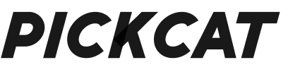

# 我们还原了编程猫被遗忘的项目

它叫 **Pickcat**。

它曾经存在过，后来消失了。留下来的不是完整源码，而是截图、图标、旧安装包、接口残片，和一小段还没有被完全抹掉的使用痕迹。我们做的事，就是把这些痕迹重新组织成一个还能运行、还能观看、还能继续被讲述的版本。

---

## Pickcat 是什么

如果把编程猫社区想成一座长期存在的网页城市，那么 Pickcat 更像是它曾经做过的一次移动端迁徙实验。

它不是简单把网页塞进手机壳里，而是有自己的一套节奏：

- 更偏移动端的首页推荐流
- 独立的喵圈入口
- 消息页
- 个人主页
- 作品浏览页
- 更强的 App 感和移动端视觉包装

从残留截图和资源命名来看，它当年认真地试图成为一个真正的 App，而不是一个临时页面。

> 有些产品死掉，不是因为它从未存在，而是因为它存在过，却没有被好好记录。

---

## 为什么要还原它

Pickcat 现在已经不能直接正常使用。原始 APK 受加固影响，服务端环境也早已变化，旧分发方式更是断代。想让它回来，已经不是“修一修老包”那么简单。

但它并没有彻底空无一物。它还留着背景图、底部导航图标、登录素材、论坛里的教程帖、零散的使用技巧页、社区里尚能访问的部分接口。

换句话说，它还留着可以被继续考古的物证。

- 旧 APK 资源还在
- 历史帖子截图还在
- 社区残留接口还在
- 一部分页面组织逻辑还能被反推出来

所以这次复刻，不是空想一个旧产品，而是尽量尊重它曾经留下来的证据。

---

## 我们做了什么

这次工程不是“魔改旧 APK”，而是三条线一起推进。

### 1. 资料线

- 提取旧 APK 里的图标、背景、按钮和登录素材
- 搜索社区残留帖子和历史截图
- 整理页面形态和使用痕迹

### 2. 接口线

- 分析编程猫社区今天仍可访问的接口
- 接入论坛、作品、用户、消息等可用数据
- 用更接近 Pickcat 的方式重新组织这些数据

### 3. 体验线

- 做出能跑的前端原型
- 复刻首页、喵圈、消息、我的、作品页和用户页
- 让它不只是“像”，而是能点、能看、能继续补完

> 真正困难的地方，不是把一个界面画得像，而是让它重新拥有“可以被使用”的因果关系。

---

## 项目现在到哪一步了

它已经不是“只能看看截图”的阶段了，而是一个接近成熟的复刻原型。

### 已经完成的部分

- 首页：推荐、发现、关注三类 feed 已形成
- 喵圈：论坛板块已被重组为移动端入口
- 作品页：评论、收藏、点赞、作者跳转和更多作品推荐已补上
- 用户页：资料、粉丝、关注和部分链路已经打通
- 消息页：可跳转到对应帖子或作品
- 多端：已有 Web、Windows、Android 原型形态

这意味着它已经不是怀旧壁纸，而是一个可以继续往前推进的项目。

---

## 关于历史截图

原本整理出来的论坛截图文件目前已经损坏，无法正常解码，所以这版 Markdown 先不继续插入坏图。

这也正好说明了这件事为什么值得做:

很多旧项目消失以后，留下来的资料并不会永远稳定存在。它们可能先失去链接，再失去来源，最后连本地文件本身也变成打不开的残片。

所以复刻 Pickcat，不只是为了“像”，也是为了在这些证据彻底散掉之前，尽可能把还能确认的东西留下来。

---

## 当前还能直接展示的本地素材

虽然历史截图坏了，但项目里仍有一批从旧包和现有原型中保留下来的可用素材。

### 启动页

这张启动页已经很能说明 Pickcat 当时的视觉方向：颜色很亮，角色很轻，气质上不是论坛网页，而是一个试图独立成立的移动产品。

### 登录页背景

登录页的背景素材保留了下来，这也是现在复刻登录页时最重要的视觉依据之一。

### 个人页头图

“我的”页面的头图也还在。它不一定能告诉你完整功能，但能把当年的界面气质重新拉回来。

### 底部导航图标

这些图标很小，却非常关键。因为一个移动端产品最先被记住的，往往就是它底部那一排最常被点击的东西。

---

## 这件事的意义

互联网总给人一种错觉，好像所有东西都会永久存在。其实不是。很多产品消失时，连告别页都没有。

一个应用死去以后，最先丢失的不是功能，而是它曾经如何被人使用、被人喜欢、被人记住的那种节奏。

我们复刻 Pickcat，并不是为了假装时间没有流逝，而是为了证明：

> 只要证据还在，体验就还能被重新拼回来。

技术在这里不是冷的。技术像一把刷子，把已经被灰尘覆盖的轮廓，一点一点重新扫出来。

---

## 接下来还会继续做

成熟，并不意味着结束。

- 继续补更多历史截图、录屏、教程和资料
- 继续把首页、发布页、消息页、用户页做得更像当年的 Pickcat
- 继续让它不只是“能看”，而是真的“能用”

> 一个被遗忘的项目，不会因为没人提起就失去价值。它只是暂时沉到了看不见的地方。

---

## 结尾

这不是一篇结束语，而是一份阶段性存档。

至少现在，我们已经能说清楚：

- Pickcat 确实存在过
- 它不是一个虚构的怀旧名字
- 它留下过足够多的痕迹
- 而我们，已经把它重新带回了可运行的世界里
